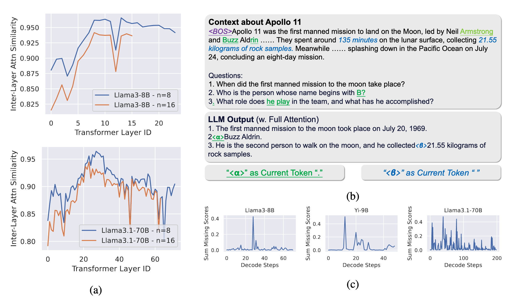

# [ICLR25] OmniKV: Dynamic Context Selection for Efficient Long-Context LLMs

📄[OmniKV Paper Link](https://openreview.net/forum?id=ulCAPXYXfa)

Existing inference acceleration methods attempt to reduce memory usage by *discarding "**unimportant**" tokens*. However, these methods have a critical flaw—they rely on attention weights at the current stage to determine token importance, ignoring the possibility that tokens may play a critical role in subsequent generation steps. This static importance evaluation mechanism fails to adapt to the dynamic contextual needs of the model, thus limiting its performance potential.

Through in-depth analysis, we discovered a key phenomenon: within a single decode step, the important tokens identified across successive layers of the model exhibit high similarity. This observation opens up new possibilities for designing more efficient inference methods.



**OmniKV**—an innovative inference approach that avoids token dropping and requires no additional training. The core ideas behind OmniKV include:

1. **Dynamic Context Selection**: During the decoding phase, OmniKV first leverages the sparsity of attention maps to select a small subset of important tokens from a "filter" layer. Then, based on "inter-layer similarity," other layers directly use this subset of selected tokens as their context.

2. **Full Token Retention**: Unlike existing methods, OmniKV retains the KV cache for all tokens, ensuring that the model can access complete information whenever necessary. This effectively eliminates performance degradation caused by information loss.

OmniKV delivers near-original model performance on benchmarks such as **LongBench** and **InfiniteBench**. It excels in multi-step reasoning tasks (e.g., chain-of-thought reasoning), successfully extending the maximum context length of the **Llama-3-8B** model on a single A100 GPU from 128K to 450K—a **3.5x** improvement. Additionally, it achieved a **1.7x speedup** on both Huggingface Transformers and the lightweight large-model inference framework LightLLM. By leveraging **Tensor Parallelism** in LightLLM, OmniKV further supports multi-GPU parallelism.


## OmniKV-huggingface

### Requirements of OmniKV
```python
torch>=2.1.0
transformers==4.41.2  # newer version may have compatibility issues
omegaconf
flash-attn
rougea
fuzzywuzzy
jieba
```
Other baselines such as InfLLM and H2O, please configure the virtual environment according to the corresponding repositories.


### Configuration
We use json files for configuration. We have provided a `example.json` in `configs`.

The description of the configuration files is as follows:

```json
{
    "cpu_num_threads": 8,  // Number of threads used for offloading
    "use_chat_template": false,  // Whether to use a chat template; in the paper, only CoT-related experiments set this to true
    "cot": false,  // Whether to use Chain of Thought (CoT)
    "max_context_len": 128500,  // Maximum context length
    "model_name": "../models/Meta-Llama-3-8B-Instruct",  // Path to the model
    "load_in_8bit": false,  // 8-bit quantization for weights
    "load_in_4bit": false,  // 4-bit quantization for weights
    "model_cls": "multi",  // Model class for OmniKV
    "cache_cls": "multi",  // KV cache class for OmniKV
    "use_flash_attn": true,  // Use flash attention to accelerate prefill
    "do_select_layers": "2,8,18",  // Specify which layers to use for selecting important tokens
    "num_wait_load_layers": 1,  // For each filter layer, how many additional layers entirely on the GPU with the full KV cache to wait for slower KV cache reads from the CPU
    "real_offload": false,  // Whether to perform actual offloading; can be disabled when GPU memory is sufficient to further accelerate computation
    "dense_more": true,  // Make wait_load_layers perform full attention, as reading from the CPU is slower (currently, false is not supported)
    "num_of_selected_tokens": 0.067,  // Number of tokens selected per filter layer, supports both integer and float values
    "selector_cls": "last",  // Selector class ["last", "uniform", "exp"]
    "window_size": 16  // Observation window size, only effective for "uniform" or "exp"
}
```

### Evaluation
#### Prepare Dataset
Longbench: Download the `THUDM/LongBench` dataset from Hugging Face, and extract the files from `data.zip` to the directory `benchmark/long_bench/data`.

Infbench: Download the `xinrongzhang2022/InfiniteBench` dataset from Hugging Face, and copy the downloaded files to the directory `benchmark/infinite_bench/data`.

#### Run Scripts

For Longbench:
```bash
PYTHONPATH=./ bash shells/eval/eval_any_long.sh configs/example.json 1
# $1 => config path
# $2 => world size (number of workers for testing)
```

For Infbench:
```bash
PYTHONPATH=./ bash shells/eval/eval_any_inf.sh configs/example.json
# $1 => config path
```

### Analysis
**Find Best "Filter Layers"**: Set the environment variable `SAVE_SELECTED_IDX=xxx` to save the model's intermediate activation values into `xxx.pkl`.


## OmniKV-Lightllm

### Installation

```bash
# copied from https://github.com/ModelTC/lightllm and modified for omnikv
# (Recommended) Create a new conda environment
conda create -n lightllm python=3.9 -y
conda activate lightllm
# Download the latest source code for Lightllm
cd omnikv-lightllm
# Install Lightllm's dependencies
pip install -r requirements.txt --extra-index-url https://download.pytorch.org/whl/cu124
# Install Lightllm
python setup.py install
```

### Usage

Change `"model_type": "llama"` to `"model_type": "llama_omnikv"` in the `config.json` file of the downloaded Hugging Face Llama weights. The `do_select_layers` is hardcoded in `lightllm/models/llama_omnikv/layer_infer/transformer_layer_infer.py`.

Then, launch using the following command.

```bash
python -m lightllm.server.api_server --model_dir /path/to/llama3-262k-omnikv --max_req_input_len 158000 --max_req_total_len 160000 --mode triton_flashdecoding --disable_cudagraph  --max_total_token_num 1041000 --running_max_req_size 100 --tp 4
```

Only `mode=triton_flashdecoding` has been adapted to OmniKV. `max_total_token_num` refers to max total number of tokens for all GPUS.

Please note that the layers selected for filtering are currently hardcoded in the code, and at present, only the Llama-3-8B-Instruct and Llama-3-70B-Instruct model series are supported.


## Citation
```text
@inproceedings{
    hao2025omnikv,
    title={Omni{KV}: Dynamic Context Selection for Efficient Long-Context {LLM}s},
    author={Jitai Hao and Yuke Zhu and Tian Wang and Jun Yu and Xin Xin and Bo Zheng and Zhaochun Ren and Sheng Guo},
    booktitle={The Thirteenth International Conference on Learning Representations},
    year={2025},
    url={https://openreview.net/forum?id=ulCAPXYXfa}
}
```

## Acknowledgement
Thanks to H2O, InfLLM, LongBench, and InfBench for their open-source contributions, which have greatly accelerated the progress of our project.

Thanks to the lightweight and easily modifiable inference framework [LightLLM](https://github.com/ModelTC/lightllm) for enabling multi-gpus functionality and tensor parallelism.

## Code Structure

```bash
├── baselines
│   ├── infllm  # Modified from https://github.com/thunlp/InfLLM
│   └── raw_h2o  # Modified from https://github.com/FMInference/H2O/tree/main/h2o_hf
├── benchmark
│   ├── infinite_bench  # Modified from https://github.com/OpenBMB/InfiniteBench
│   └── long_bench  # Modified from https://github.com/THUDM/LongBench
├── configs
│   ├── example.json  # Example configuration file
│   └── template_for_chat.py  # Configures the prompt template for CoT testing
├── infer.py  # One of the core entry points; contains `get_any_chat_api` that takes a `cfg_path` and returns the chat API generated by the specified model and inference method.
├── modeling
│   ├── brutal_offload_llama.py  # Brutal offloading: starting from a specific layer, KV cache is fully transferred between CPU and GPU as needed.
│   ├── compressor.py
│   ├── _old_test.py
│   ├── offload_select_once.py
│   ├── omnikv.py   # Main model-related implementation for OmniKV
│   ├── omnikv_config.py  # Configuration class for OmniKV
│   ├── patch_of_llama3_1.py  # Supports rope scaling for LLaMA 3.1 under `transformers==4.41.2`
│   ├── select_once_model.py
│   ├── spec_cache.py  # Main KV cache-related implementation for OmniKV
│   └── token_model.py
├── shells
│   ├── eval
│   │   ├── efficiency_test.sh
│   │   ├── eval_any_inf.sh  # Tests infbench
│   │   └── eval_any_long.sh  # Tests longbench
│   ├── series_exps 
│   │   └── parallel_cot.sh  # Tests CoT performance
│   └── temp_2stage.py
├── tiny_runs  # Mainly contains code for activation value analysis
│   ├── ana_cot.py
│   ├── ana_motivation2.py   # Identifies the layer with the best filtering capability
│   ├── detail_attn_feature.py
│   ├── end_to_end_latency_test.py  # Generates latency data and corresponding graphs for OmniKV (HF version)
│   ├── make_2_stage_questions.py  # Generates 2StageRetr dataset
└── tiny_tools
    ├── draw.py
    ├── get_code_id.py
    ├── log.py
    ├── read_json.py
    ├── read_logs.py
    └── tensor_tools.py  # Implements `SAVE_SELECTED_IDX` to save intermediate activations for analysis
```
